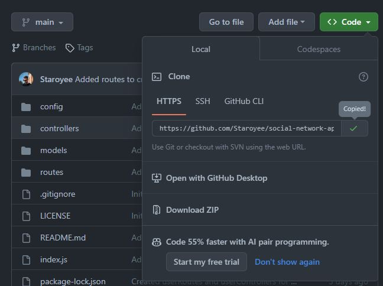

# social-network-api

## Description

I was tasked to create a social network API using mongoDB, mongoose and express.js

I was motivated to undertake this task because I wished to gain a greater understanding of how to create APIs and use a non-relational database (MongoDB with mongoose).
## Solve

The completion of this project provides the user with a social network API. This API contains functionality to find, create, update and delete users, friends, thoughts, and reactions.

## Installation

Steps to install this project on your local PC

1. Open the termal on your machine.
2. Use the terminal command `cd` to navigate to the directory where you want the repository located.
3. Locate the 'Code' button on the 'social-network-api' github repository, click it, then copy the 'HTTPS' link to clipboard. (See image)

4. Use the git command `git clone` followed by the URL copied from Github to clone the repo to your machine.
5. The `git clone` command creates a new directory with the same name as the repository. Navigate into your new directory using `cd`.
6. The repository should now be cloned onto your device and able to be edited in VScode or another editing software.

## Demo Video Link
https://drive.google.com/file/d/1FeLyjq0kVJEt7UYutOH0fZgktLMgcBP8/view?usp=sharing

## Instructions

To use the app:

1. Open the index.js file in the CLI.
2. Run 'npm i' to install required dependancies.
3. Run 'npm run dev' or 'node index.js' to start the server connection to the database.
4. Use the routes defined in the index.js, thoughtRoutes, and userRoutes files inside an app such as insomia to test the routes.

## Resources

- Received tutor assistance.
- Week 18 activities.
- https://www.npmjs.com/package/mongoose
- https://www.npmjs.com/package/express
- https://mongoosejs.com/docs/tutorials/lean.html
- https://mongoosejs.com/docs/queries.html
- https://mongoosejs.com/docs/api/aggregate.html
- https://developer.mozilla.org/en-US/docs/Web/JavaScript/Reference/Global_Objects/Array/splice
- https://developer.mozilla.org/en-US/docs/Web/JavaScript/Reference/Global_Objects/Array/indexOf
- https://www.mongodb.com/docs/manual/reference/operator/update/pull/
- https://intellipaat.com/community/43245/mongoose-delete-array-element-in-document-and-save
- https://www.mongodb.com/docs/manual/reference/operator/update/push/
- https://mongoosejs.com/docs/guide.html
- https://mongoosejs.com/docs/tutorials/dates.html
- https://mongoosejs.com/docs/validation.html
- https://www.npmjs.com/package/validator